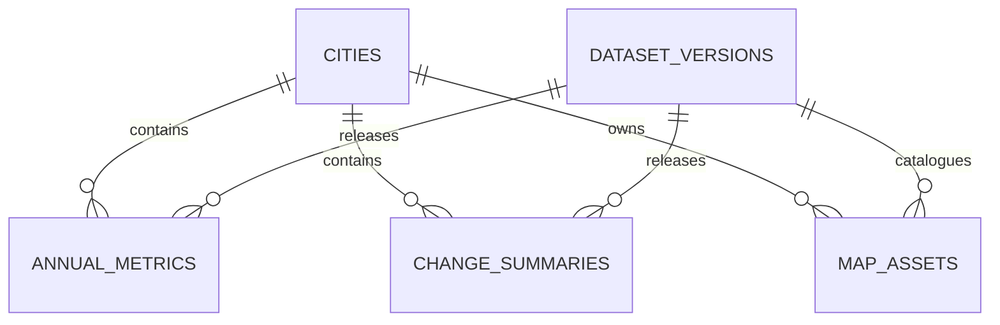

# NusaUrban Observatory — Database Schema & Data Model

The relational schema is defined using Drizzle ORM in `src/lib/db/schema.ts` targeting PostgreSQL (Neon).

## Table Specifications

### 1. `cities`
Administrative and geographic reference for each monitored urban center.
- `id`: `serial PRIMARY KEY`
- `slug`: `varchar(50) UNIQUE NOT NULL` (e.g., `'jakarta'`, `'bandung'`)
- `display_name`: `varchar(100) NOT NULL` (e.g., `'DKI Jakarta'`)
- `country_code`: `varchar(2) DEFAULT 'ID'`
- `province`: `varchar(100)`
- `description_en`: `text`
- `description_id`: `text`
- `center_longitude`: `real NOT NULL`
- `center_latitude`: `real NOT NULL`
- `default_zoom`: `integer DEFAULT 11`
- `boundary_url`: `varchar(500)`
- `created_at`: `timestamp DEFAULT now()`
- `updated_at`: `timestamp DEFAULT now()`

### 2. `dataset_versions`
Tracks releases, scientific versions, projections, and validation gates.
- `id`: `serial PRIMARY KEY`
- `version_key`: `varchar(100) UNIQUE NOT NULL` (e.g., `'published_2017_2025'`)
- `title`: `varchar(500)`
- `description`: `text`
- `source`: `varchar(200)`
- `projection_source`: `varchar(20) DEFAULT 'EPSG:32748'`
- `map_projection`: `varchar(20) DEFAULT 'EPSG:3857'`
- `pixel_size_m`: `integer DEFAULT 10`
- `min_zoom`: `integer DEFAULT 8`
- `max_zoom`: `integer DEFAULT 14`
- `status`: `varchar(20) DEFAULT 'draft'` ('draft', 'reconciling', 'published')
- `published_at`: `timestamp`
- `created_at`: `timestamp DEFAULT now()`

### 3. `annual_metrics`
Annual classification surface areas, accuracy, and statutory RTH proxy calculations.
- Unique constraint: `(city_id, dataset_version_id, year)`
- `id`: `serial PRIMARY KEY`
- `city_id`: `integer REFERENCES cities(id)`
- `dataset_version_id`: `integer REFERENCES dataset_versions(id)`
- `year`: `integer NOT NULL`
- `accuracy`: `real` (Overall Accuracy [0–1])
- `kappa`: `real` (Cohen's Kappa coefficient [0–1])
- `veg_km2`: `real`, `veg_pct`: `real`
- `water_km2`: `real`, `water_pct`: `real`
- `urban_km2`: `real`, `urban_pct`: `real`
- `open_km2`: `real`, `open_pct`: `real`
- `total_km2`: `real`
- `rth_proxy_km2`: `real` (Veg + Water)
- `rth_proxy_pct`: `real`
- `rth_target_pct`: `real DEFAULT 30`
- `rth_deficit_km2`: `real`
- `rth_deficit_pct`: `real`
- `rth_compliant`: `boolean` (true if rth_proxy_pct >= 30)
- Per-class accuracy: `pa_veg`, `ua_veg`, `pa_water`, `ua_water`, `pa_urban`, `ua_urban`, `pa_open`, `ua_open`
- `source_file`: `varchar(500)`
- `analysis_version`: `varchar(100)`
- `reconciliation_status`: `varchar(20) DEFAULT 'pending'`
- `reconciliation_note`: `text`
- `created_at`: `timestamp DEFAULT now()`

### 4. `change_summaries`
Multi-temporal vegetation change comparison between 2017 and 2025.
- `id`: `serial PRIMARY KEY`
- `city_id`: `integer REFERENCES cities(id)`
- `dataset_version_id`: `integer REFERENCES dataset_versions(id)`
- `baseline_year`: `integer` (2017)
- `final_year`: `integer` (2025)
- `baseline_vegetation_km2`: `real`
- `final_vegetation_km2`: `real`
- `endpoint_net_change_km2`: `real` (Final - Baseline)
- `filtered_loss_km2`: `real` (Patch-filtered loss)
- `filtered_gain_km2`: `real` (Patch-filtered gain)
- `filtered_net_change_km2`: `real` (Gain - Loss)
- `minimum_patch_pixels`: `integer DEFAULT 9`
- `connectivity`: `integer DEFAULT 4`
- `pixel_size_m`: `integer DEFAULT 10`
- `source_file`: `varchar(500)`
- `reconciliation_status`: `varchar(20) DEFAULT 'pending'`
- `reconciliation_note`: `text`

### 5. `map_assets`
Inventory of Cloudflare R2 PMTiles and GeoJSON boundary objects.
- `id`: `serial PRIMARY KEY`
- `city_id`: `integer REFERENCES cities(id)`
- `dataset_version_id`: `integer REFERENCES dataset_versions(id)`
- `year`: `integer NULL`
- `kind`: `varchar(30) NOT NULL` ('lulc', 'vegetation_change', 'boundary')
- `r2_path`: `varchar(500) NOT NULL`
- `format`: `varchar(20) DEFAULT 'pmtiles'`
- `min_zoom`: `integer`
- `max_zoom`: `integer`
- `size_bytes`: `integer`
- `checksum`: `varchar(128)`

### 6. `publications`
Scholarly publication records linked to displayed datasets.

### 7. `ingest_runs`
Audit and reproducibility trail recording data import timestamps, row counts, warnings, and source file SHA-256 hashes.
